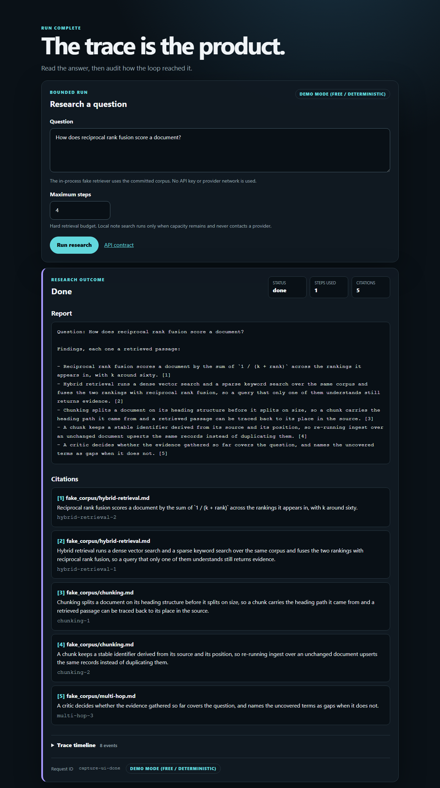
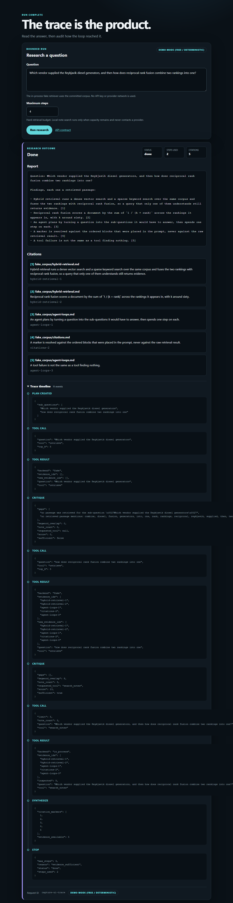
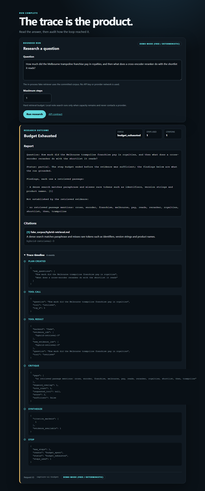

# agentic-rag-research

<p align="center">
  <a href="https://github.com/pabloalvarez99/production-rag"></a>
  <a href="https://github.com/pabloalvarez99/agentic-rag-research"></a>
  <a href="https://github.com/pabloalvarez99/multi-agent-orchestration"></a>
  <a href="https://github.com/pabloalvarez99/repomind"></a>
  <a href="https://github.com/pabloalvarez99/ai-platform"></a>
</p>

> Production-shaped AI systems: free-path demos, real architecture, measurable behavior,
> honest scope.

An agentic RAG research agent: a bounded **plan → retrieve → critique** loop over a
retrieval service, with cited reports, explicit refusal, step budgets, and a complete
execution trace. The whole default path runs on deterministic local providers: **$0,
no API key, no signup, no network.**

Portfolio series #2. Series #1 is
[production-rag](https://github.com/pabloalvarez99/production-rag), which builds the
retrieval substrate this agent reasons over — hybrid dense plus sparse retrieval fused
with reciprocal rank fusion, cross-encoder reranking, answers whose citation markers
resolve to real chunks, and refusal as a first-class outcome. This repository does not
re-litigate those decisions and does not reimplement that retrieval stack; it consumes
it and asks the next question: **what does an agent add over a single retrieval pass,
and how do you tell?**

## Status: v0.2.0 — auditable free path (notes store · run artifacts · stream · control evals)

The loop is complete as a library and exposed through both runtime surfaces:
`plan → retrieve → critique`, bounded by a step budget, ending in a report whose every
marker resolves to a passage that was actually retrieved — or in an explicit refusal.
`GET /health`, `POST /v1/research`, the CLI, the offline evaluation harness, and the
server-rendered research UI are live ([docs/SHIP.md](docs/SHIP.md)). The optional HTTP
retriever can call a running production-rag instance, but the default path contacts
nothing and reads no API key.

**Try it without cloning: <https://pax-agentic-rag.vercel.app>.** Fixture retriever only —
**control demo, zero quality claim.** Stream steps live, refuse an off-corpus question,
and download the stored trace. 10-minute script: [docs/CASESTUDY.md](docs/CASESTUDY.md).
Locally the same page is <http://127.0.0.1:8010/>.

| Capability | State | Evidence |
| --- | --- | --- |
| Plan → retrieve → critique, bounded by `max_steps` | **LIVE** | loop and state tests |
| Typed note store + critic on grounded/on-topic notes | **LIVE** | [ADR-0004](docs/adr/0004-notes-are-a-store.md); notes/store tests |
| Grounded report, refusal, and stop reasons | **LIVE** | synthesizer and terminal-outcome tests |
| Full deterministic execution trace (offsets, not wall clock) | **LIVE** | typed events ending in `stop` |
| FastAPI `POST /v1/research` and JSON CLI | **LIVE** | OpenAPI, API/CLI parity, and error tests |
| `GET /v1/runs/{id}` run artifact + trace download | **LIVE** | bounded in-process store; runs tests |
| `GET /v1/research/stream` SSE step stream | **LIVE** | plan → retrieve → critique events; stream tests |
| Fake retriever over packaged Markdown | **LIVE** | default, offline, credential-free |
| production-rag HTTP adapter | **LIVE (opt-in)** | mock transport; live slice gated + skipped in CI |
| 17-case golden dataset | **LIVE** | five behavior slices; [schema and coverage](data/eval/README.md) |
| Control scorecard (steps, stop reasons, citations, refused_unanswerable) | **LIVE** | never quality / never "beats GPT" |
| Research UI + live step timeline + stored-trace download | **LIVE** | `/`, SSE, `GET /v1/runs/{id}/trace.json` |
| Local `search_notes` tool | **LIVE (optional)** | critic request, deterministic tool tests, trace events |
| Tagged release | **LIVE** | [v0.2.0 notes](docs/releases/v0.2.0.md) |
| UI captures of the three outcomes | **LIVE** | [committed PNGs](#what-that-looks-like-before-you-run-it) rebuilt by `scripts/capture_ui.py` |
| `GET /metrics` Prometheus exposition | **LIVE** | `process_up`, `requests_total`, `research_total`, `research_steps_used_total` |
| Hosted free-path demo | **LIVE** | [pax-agentic-rag.vercel.app](https://pax-agentic-rag.vercel.app) — fixture only |

Start with the [architecture](docs/architecture.md), read the one-page
[ship truth](docs/SHIP.md), or use the [case study](docs/CASESTUDY.md) as the
problem/options/decision narrative.

```console
$ python -m agentic_rag.research --question "Why use RRF in hybrid search?" --retriever fake
{"status": "done", "report": "...", "citations": [...], "steps_used": 1, "trace": [...], ...}
status=done steps_used=1 citations=5 retriever=fake request_id=54e7dfaf-…
```

The JSON goes to stdout and the one-line summary to stderr, so `… | jq` works without
a flag. The same run as a library call:

```python
from agentic_rag.agent import run_research

state = run_research("What does hybrid retrieval buy over dense retrieval alone?")

state.status         # <ResearchStatus.DONE: 'done'>
state.stop_reason    # 'evidence_sufficient'
state.steps_taken    # 1 of a budget of 4
state.evidence_ids   # ('hybrid-retrieval-1', 'hybrid-retrieval-2', ...)
[c.marker for c in state.citations]     # [1, 2, 3, 4, 5]
state.note_ids       # ('note-1', 'note-2', ...) — one claim per new passage
[e.event for e in state.trace]
# ['plan_created', 'tool_call', 'tool_result',
#  'note_added', 'note_added', 'note_added', 'note_added', 'note_added',
#  'critique', 'tool_call', 'tool_result', 'synthesize', 'stop']
```

A `Note` is `{id, claim, source, citation}`: the claim is the retrieved chunk verbatim,
and `citation` is the chunk id backing it. The stop rule scores grounded, on-topic notes
plus the question terms they cover — never note count alone
([ADR-0004](docs/adr/0004-notes-are-a-store.md)).

The second call is `search_notes`: when several notes are already sufficient, the
critic may ask a deterministic in-process tool to rank the run's own store before
synthesis. It cannot retrieve, generate, or contact a provider, and it only runs when
retrieval capacity remains.

```text
Question: What does hybrid retrieval buy over dense retrieval alone?

Findings, each one a retrieved passage:

- Hybrid retrieval runs a dense vector search and a sparse keyword search over the
  same corpus and fuses the two rankings with reciprocal rank fusion, so a query that
  only one of them understands still returns evidence. [1]
- Reciprocal rank fusion scores a document by the sum of `1 / (k + rank)` across the
  rankings it appears in, with k around sixty. [2]
```

Ask it something the corpus cannot answer and it says so, naming what it looked for:

```python
state = run_research("What were the quarterly revenues in Patagonia?", max_steps=3)

state.status                          # <ResearchStatus.REFUSED: 'refused'>
state.stop_reason                     # 'no_evidence'
state.citations                       # []
[gap.detail for gap in state.gaps]
# ["no passage was retrieved for the sub-question 'What were the quarterly revenues
#   in Patagonia?'", ..., 'no retrieved passage mentions: patagonia, quarterly, revenues']
```

Set `PRODUCTION_RAG_URL` to aim the same tool at a running production-rag instance
(`POST /v1/query`, free providers pinned on both sides). Unset — the default, and what
every test runs on — retrieval is in-process.

## The loop

```
question
   │
   ├─► plan ─────────► sub-questions, ordered, one retrieval each
   │      ▲                       │
   │      │                       ▼
   │      │              retrieve ──► passages + source ids  ──┐
   │      │                       (one sub-question per call)  │
   │      │                                                    ▼
   │      │                                              critique
   │      │                                                    │
   │      │  gap named, steps left                             │
   │      └────────────────────────────────────────────────────┤
   │                                                           │
   │                          evidence sufficient ─────────────┼──► answer + citations
   │                                                           │
   │                          budget spent, still thin ────────┴──► refusal + reason
   ▼
trace: every step, its tool, its evidence, its cost — written whichever way the loop ends
```

Only `critique` can end the loop, so there is one place to audit when a run ends
wrongly. The bound is the point: an agent without a step budget and a stop rule is a
way to spend money on tokens until something times out.

Every run reaches one of three terminal states, and the status field is not allowed to
flatter the run:

| Status | When | What the report contains |
| --- | --- | --- |
| `done` | The evidence was sufficient. | Findings, each a cited passage. |
| `budget_exhausted` | Evidence was gathered, never became sufficient, and the steps ran out. | The grounded findings **and** the gaps it never closed. |
| `refused` | Nothing was retrieved, or what was is too thin to answer from. | The refusal, its named gaps, and any passages gathered — still cited. |

Two independent bounds guarantee termination: the step budget, enforced inside the
state rather than by the loop's condition, and the rule that no sub-question is ever
retrieved for twice. The planner, the critic's score and the synthesiser are
deterministic and call no provider — a run is byte-identical when repeated, traces
included, which is what lets a test assert on one. Tool boundaries, the scoring rule,
the trace's event set, and why there is no graph library yet are in
[docs/architecture.md](docs/architecture.md).

## Try it free — $0, no API key

Requires Python 3.12+. Commands below use the Windows venv layout; on macOS or
Linux replace `.venv/Scripts` with `.venv/bin`.

```bash
python -m venv .venv
.venv/Scripts/pip install -e ".[dev]"
.venv/Scripts/pytest -q
.venv/Scripts/python -m agentic_rag.research \
  --question "Why use reciprocal rank fusion?" --retriever fake
.venv/Scripts/uvicorn agentic_rag.main:app --port 8010
curl -s http://127.0.0.1:8010/health
```

```json
{"status": "ok", "service": "agentic-rag-research", "version": "0.1.0"}
```

The research UI is at <http://127.0.0.1:8010/> and the interactive API document is at
<http://127.0.0.1:8010/docs>. The UI fixes `retriever=fake`; there is no form control
that can turn the free demo into a provider call.

```bash
curl -s http://127.0.0.1:8010/v1/research \
  -H "content-type: application/json" \
  -d '{"question":"Why use reciprocal rank fusion?","retriever":"fake"}'
```

### What that looks like before you run it

Every image below is a real run of the command above, captured from the running
application by [`scripts/capture_ui.py`](scripts/capture_ui.py). **Deterministic fake
retriever. Contract demo, not answer quality.**

**A grounded answer.** Terminal status, retrieval steps spent, and one citation per
marker — each resolving to a passage the run actually retrieved — plus the request id
that correlates the page with the server log.



**The trace, expanded.** A two-hop question whose first sub-question retrieves nothing.
The timeline shows `plan_created`, both `tool_call`/`tool_result` pairs, the `critique`
arithmetic that decided to continue, `synthesize`, and the `stop` event carrying the
status, the reason, and the budget. A run today also emits one `note_added` per claim it
commits to; this capture was taken before those events existed and is re-taken with the
next UI change rather than described as if it showed them.



**A budget that ran out.** One retrieval step, evidence that never became sufficient:
the run reports its grounded finding *and* the terms no passage covered, and stops with
`budget_spent` rather than answering past its evidence.



Rebuild them with `pip install -e ".[docs]"`, `playwright install chromium`, then
`python scripts/capture_ui.py`; `python scripts/capture_ui.py --verify` re-captures into
a temporary directory and compares SHA-256 digests against the committed files.

### Taking the run with you

**The trace can leave the page.** The download button under the timeline saves the run's
events as JSON — the same list `POST /v1/research` returns under `trace`. The API serves
it directly at `POST /v1/research/trace`, which takes the same body as the research route
and answers with the events as an attachment:

```bash
curl -s -OJ http://127.0.0.1:8010/v1/research/trace \
  -H "content-type: application/json" \
  -d '{"question":"Why use reciprocal rank fusion?","retriever":"fake"}'
```

There is no stored "last trace" to fetch. A server-side slot holding the most recent run
would be shared state between requests, and two callers exporting at once would race for
it; the run is performed for the export instead, which on the free path is deterministic,
so the file matches the page it came from.

**What an operator can scrape.** `GET /metrics` returns the Prometheus text format:
`process_up`, `requests_total` by method/route/status, `research_total` by terminal
status, and `research_steps_used_total`. Counters are process-local, the route label is
restricted to routes this service declares, and no question text or correlation id is
ever a label. It is operational plumbing — it says how many runs ended `refused`, never
whether they should have.

## How it uses series #1

The loop depends on one interface with a single `search` method, and cannot tell its
two implementations apart:

| Backend | What it is | When |
| --- | --- | --- |
| Fake | In-process fixture over the markdown corpus shipped in the package (`agentic_rag/data/fake_corpus/`), deterministic per sub-question | The default — every test, every CI run, every laptop demo |
| HTTP | Client for a running production-rag instance, `POST /v1/query` | Opt-in; mock-transport tested, no live-service result claimed |

Set `PRODUCTION_RAG_URL` and explicitly choose `retriever=http` to use the HTTP
backend. Without that explicit choice, retrieval stays in-process. If HTTP is requested
without configuration, the runtime returns `capability_missing`; it never falls back
silently and labels fake evidence as real-service output.

The HTTP backend reads the `citations` array — each entry is already a passage with a
chunk id and a source path — rather than the inner service's generated answer, because
an agent that paraphrases another model's answer is not retrieving anything. A
`refused: true` response is information, not a failure: it means one sub-question found
no support, which is a gap `critique` can name.

**P1 is consumed, not copied.** No retrieval, fusion, rerank or citation-resolution code
is reimplemented here — a fork of that stack would make the comparison against the
single-pass baseline meaningless.

## Two rules this project keeps from series #1

- **Evidence or refusal.** A step that cannot cite does not answer. An agent that
  paraphrases its own plan back as a finding is worse than one that stops.
- **Free by default.** Deterministic local providers are the default, so every test and
  every demo runs in CI and on a laptop with no credential. A hosted provider is an
  opt-in override; `.env.example` carries the variable name and no value. The reasoning
  and its rejected alternatives: [ADR-0001](docs/adr/0001-fake-first.md).

The fake backend proves control flow, budget accounting, the stop rule, the refusal path
and the trace. It proves nothing about retrieval or answer quality, and this repository
will not publish a quality number produced by it.

## Layout

| Path | What lives there |
| --- | --- |
| `src/agentic_rag/` | App factory, API/CLI service boundary, deterministic agent loop, corpus loader, and shared text rules. |
| `src/agentic_rag/tools/` | The tool protocol, `retrieve` with fake/HTTP backends, and deterministic in-process `search_notes`. |
| `src/agentic_rag/agent/` | The loop: `state` (budget, evidence, trace), `planner`, `critic`, `synthesizer`, `graph`. |
| `src/agentic_rag/templates/`, `static/` | Accessible dark UI for the free research path and typed failures. |
| `src/agentic_rag/evals/`, `data/eval/` | Offline evaluation runner and committed golden research cases. |
| `tests/` | Offline tests. No network, no credentials. |
| `data/eval/` | 17 hand-written goldens, schema, and curation rules for the M5 runner. |
| `scripts/capture_ui.py`, `docs/assets/` | Deterministic Playwright capture of the three UI outcomes, and the committed PNGs it writes. |
| `docs/architecture.md` | Implemented loop, tool boundaries, retrieval seam, budgets, failures, and milestones. |
| `docs/adr/` | Three accepted decision records with alternatives and consequences. |
| `docs/SHIP.md` | One-page LIVE/PLANNED truth, release gate, and failure demos. |
| `CHANGELOG.md` | Keep-a-Changelog history for v0.1.0. |
| `docs/releases/v0.1.0.md` | Honest release notes and evidence boundary. |
| `docs/PORTFOLIO.md` | P1 → P5 series narrative and ownership boundary. |
| `.env.example` | Variable names for opt-in paths. Never values. |

## Portfolio context

This is project 2 in a five-system ladder: P1 retrieves and answers honestly; P2 acts
with tools under budget; P3 coordinates bounded specialists; P4 now answers code questions
with AST-derived `path:line` evidence; P5 will operate the services behind a platform edge. The full,
honestly labelled map is in [docs/PORTFOLIO.md](docs/PORTFOLIO.md).

Release history is in [CHANGELOG.md](CHANGELOG.md); the release-facing boundary is in
[docs/SHIP.md](docs/SHIP.md).

## License

MIT — see [LICENSE](LICENSE).
