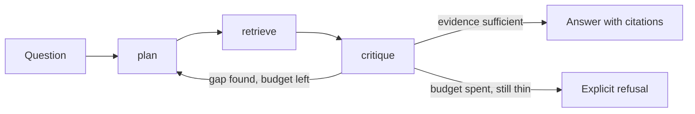

# Architecture — planned, not implemented

Status: **scaffold**. The only route that exists is `GET /health`. Everything on
this page is a plan, and the milestones below say which parts are absent.

## The loop

The agent is a bounded loop over three tools. The bound is the point: an agent
without a step budget and a stop rule is a way to spend money on tokens until
something times out.

| Tool | Responsibility | Boundary it must not cross |
| --- | --- | --- |
| `plan` | Turn the question into an ordered list of sub-questions, each answerable by one retrieval call. | It does not retrieve, and it does not answer from parametric memory. |
| `retrieve` | Run one sub-question against the retrieval service and return passages with their source ids. | It does not rank by what would make the answer nicer; ranking belongs to the retrieval service. |
| `critique` | Decide whether the evidence supports an answer, name the gap when it does not, and stop when the budget is spent. | It never fills a gap by inventing a passage. Insufficient evidence ends in a refusal, not a hedge. |

## What it inherits from production-rag

The retrieval substrate is [production-rag](../../production-rag): hybrid dense
plus sparse retrieval fused with reciprocal rank fusion, a cross-encoder rerank
pass, grounded answers whose citation markers resolve to real chunks, and a
refusal that is a first-class outcome rather than an error. This project treats
that service as a dependency and reuses two of its rules verbatim:

- **Evidence or refusal.** A step that cannot cite does not answer.
- **Free by default.** Deterministic local providers are the default path, so
  the whole loop runs in CI and on a laptop with no credential.

## Provider stance

The default providers are deterministic fakes, chosen so a run is repeatable and
free. A hosted provider is an opt-in override, never a default, and no code path
reads a key to serve the scaffold. `.env.example` lists the variable names a
future paid path would use; it carries no values.

## Milestones

| Milestone | Contents | State |
| --- | --- | --- |
| M0 | Package, liveness probe, test harness, this document | **LIVE** |
| M1 | `retrieve` tool against the retrieval service, with a fake retriever for tests | planned |
| M2 | `plan` tool and the step budget | planned |
| M3 | `critique` tool, the stop rule, and the refusal path | planned |
| M4 | Trace of the loop: every step, its tool, its evidence, its cost | planned |
| M5 | Offline evaluation of the loop against a fixed question set | planned |

## Open questions

- Where does the step budget live — per question, per run, or both?
- Does `critique` see the retrieved passages, or only the claims made from them?
  Seeing both is more capable and makes the critique harder to trust.
- What does the trace have to record for a failed run to be diagnosable a week
  later without rerunning it?
