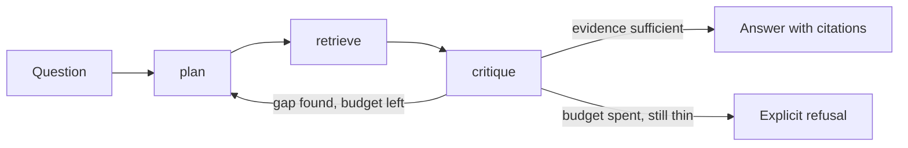
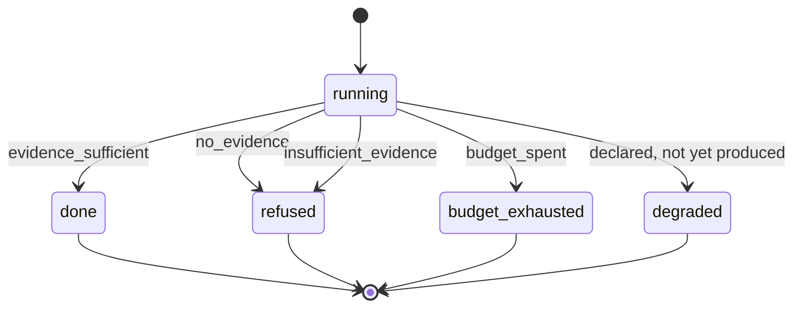

# Architecture — the loop is code, the service around it is not

Status: **M2**. The only route is still `GET /health`, but everything below the
route is now implemented: `plan`, `retrieve`, `critique`, the bounded loop that
calls them, the stop rule, the refusal path, the report with citations, and the
trace. `run_research()` runs the whole thing in-process on the free path. What is
still absent is the way in — `POST /v1/research` and the CLI — and the offline
evaluation. The milestones table says which parts those are.

The question this project exists to answer: **what does a bounded agent loop add
over a single retrieval pass, and how would you tell?** The design below is
arranged so that question stays answerable — every seam is one a fake can stand
in for, so the loop is measurable before it is expensive.

## The loop

The agent is a bounded loop over three tools. The bound is the point: an agent
without a step budget and a stop rule is a way to spend money on tokens until
something times out.



### One pass through the loop

The same shape as text, because the arrows above hide where state accumulates
and where the loop can end:

```
question
   │
   ├─► plan ─────────► sub-questions, ordered, one retrieval each
   │      ▲                       │
   │      │                       ▼
   │      │              retrieve ──► passages + source ids  ──┐
   │      │                       (one sub-question per call)  │
   │      │                                                    ▼
   │      │                                              critique
   │      │                                                    │
   │      │  gap named, steps left                             │
   │      └────────────────────────────────────────────────────┤
   │                                                           │
   │                          evidence sufficient ─────────────┼──► answer + citations
   │                                                           │
   │                          budget spent, still thin ────────┴──► refusal + reason
   ▼
trace: every step, its tool, its evidence, its cost — written whichever way the loop ends
```

Three properties of that shape are deliberate:

- **Only `critique` can end the loop.** `plan` cannot declare success and
  `retrieve` cannot declare failure. One exit point means one place to audit
  when a run ends wrongly.
- **The refusal edge is not an error path.** It is a normal outcome with a
  reason, recorded like any other. A loop that can only answer will invent one.
- **The trace is written on every exit.** A run that refused is the run most
  worth reading later, so the trace is not conditional on success.

## Tool boundary

| Tool | Responsibility | Boundary it must not cross |
| --- | --- | --- |
| `plan` | Turn the question into an ordered list of sub-questions, each answerable by one retrieval call. | It does not retrieve, and it does not answer from parametric memory. |
| `retrieve` | Run one sub-question against the retrieval service and return passages with their source ids. | It does not rank by what would make the answer nicer; ranking belongs to the retrieval service. |
| `critique` | Decide whether the evidence supports an answer, name the gap when it does not, and stop when the budget is spent. | It never fills a gap by inventing a passage. Insufficient evidence ends in a refusal, not a hedge. |

The full surface, what is deliberately absent from it, and why the retrieval
service sits behind a *second* protocol rather than inside the tool, are recorded
in [ADR-0003](adr/0003-tool-boundary.md).

Two rules apply to all three, and they are what make the loop testable rather
than merely describable:

1. **A tool call is a function of its arguments and the retrieval service.** No
   tool reads ambient configuration or global mutable state, so replaying a
   trace's arguments reproduces the step.
2. **Every tool returns evidence or an explicit absence.** A tool never returns
   prose that a later step has to parse to discover whether it worked. The
   difference between "found nothing" and "failed" is a field, not a tone.

### What is not a tool

Stated now, because the cheapest time to refuse a capability is before it has a
call site:

- **No write tool.** The agent reads a corpus; it does not ingest, index, or
  mutate anything in the retrieval service.
- **No shell, no filesystem, no arbitrary HTTP.** The only outbound surface is
  the retrieval boundary below.
- **No sub-agent spawning.** One agent, one loop. Orchestration between agents
  is series project #3 and does not leak backwards into this one.

## The loop as code (M2)

`run_research(question, tool=..., max_steps=..., top_k=...)` in
`agentic_rag.agent.graph` returns a finished `ResearchState`. The nodes are thin
— each one calls a pure function that is tested on its own — and all the state
transitions live on `ResearchState`, which is the only thing that can change a
run.

### The deterministic core

| Component | Rule | Where |
| --- | --- | --- |
| `plan_question` | Question under 80 characters is one sub-question; otherwise split on `and` / `then` / `?`, drop fragments carrying no scoring term, drop repeats, cap at 3. | `agent/planner.py` |
| `critique` | `score = distinct passages + question terms they cover`; sufficient at `score >= 3` with at least one passage; otherwise name gaps. | `agent/critic.py` |
| `synthesize` | One bullet per passage, marked `[n]` in the order evidence was first seen. No paraphrase, no model. | `agent/synthesizer.py` |
| `decide_outcome` | Pure function of three booleans: sufficient, has evidence, budget spent. | `agent/graph.py` |

None of these calls a provider, free or otherwise. The score is a **stop rule,
not a quality measure**: it is written to be predictable and recomputable by
hand from the trace, and it is not tuned against a labelled set, because no
labelled set exists yet.

### How a run ends

| Status | When | Report |
| --- | --- | --- |
| `done` | The critique found the evidence sufficient. | Findings, each a cited passage. |
| `budget_exhausted` | Evidence was gathered, never became sufficient, and the step budget ran out. | Partial: the grounded findings **and** the gaps it never closed. |
| `refused` | Nothing was retrieved (`no_evidence`), or what was retrieved is too thin to answer from and no further retrieval could help (`insufficient_evidence`). | The refusal, its named gaps, and whatever passages were gathered — still cited. |
| `degraded` | Declared, not yet produced. Reserved for a run that finished around a tool failure. | — |

The `insufficient_evidence` refusal exists so the status field cannot lie: a run
that stopped with steps to spare must not report `budget_exhausted`, which is the
first field an operator would check when asking why a run was thin. The same four
outcomes as a function of the three facts that decide them, alongside the typed
failures that are *not* outcomes, are in [Failure modes](#failure-modes).

### Two independent bounds

Termination does not depend on the critic being right:

1. **The step budget** is enforced inside `ResearchState.record_retrieval`, not
   by the loop's condition. Recording a step past the budget raises rather than
   being silently dropped, because a run that quietly stops recording still looks
   complete in its trace.
2. **No sub-question is retrieved for twice.** Follow-ups proposed by a critique
   are checked against everything already requested, so the queue strictly
   shrinks. Without that rule, a gap no retrieval can close would be re-issued
   until the budget ran out, and every thin run would report `budget_exhausted`
   whatever actually stopped it.

Two budgets, bounding two different costs:

| Budget | Bounds | Default | Enforced by |
| --- | --- | --- | --- |
| `max_steps` | Retrieval calls one run may make. | 4 | `ResearchState.record_retrieval`, which raises `StepBudgetExceeded` rather than dropping the step. |
| `top_k` | Passages one retrieval call may return — the context a single step drags back. | 5 | The `retrieve` tool, applied to what the backend returned. |

There is deliberately **no wall-clock and no spend budget** at this milestone.
`max_steps` bounds the only cost the free path has: the fake backend contacts
nothing and bills nothing, so a timeout would be dead code and a spend ceiling a
field that always reads zero. Both are the right bounds the moment the HTTP
backend runs against a real instance, and they land there, with the failure they
exist to survive in front of them. The reasoning, the outcome table below, and
the alternatives rejected on the way are in
[ADR-0002](adr/0002-step-budget.md).

### The trace

Six event kinds, in the order a complete run emits them: `plan_created`,
`tool_call`, `tool_result`, `critique`, `synthesize`, `stop`. Every run ends with
`stop`, including a refusal — the run that refused is the one most worth reading
later.

The trace carries **no timestamps**. A free-path run is deterministic, so two
runs of the same question produce byte-identical traces and a test can assert on
one directly. Wall-clock timings are an observability concern and arrive with the
HTTP route, where there is a request id to bind them to.

The `critique` event carries the whole arithmetic — passage count, term overlap,
score, verdict — so a stop decision is reproducible from the trace alone. The
`tool_result` event separates the ids a step returned from the ids that were new,
which is what distinguishes a step that re-retrieved known passages from one that
found nothing.

### Why there is no graph library yet

LangGraph is the obvious fit and is deliberately not a dependency at M2. Every
node here is a two-line call into a pure function that is already tested
independently; a framework would add a dependency, an import-time registry and a
second place to read the control flow, in exchange for a picture of a loop that
fits on one screen. The seam it would occupy is the node functions in
`agent/graph.py`, which take a state and return nothing — adopting one later is a
rewiring, not a rewrite. The moment that changes is branching the loop cannot
express as a `while`: parallel sub-question fan-out, or checkpoint and resume.

## The retrieval boundary

Everything the agent knows about the world arrives through one interface with a
single method. Naming it before implementing it is the whole point: it is the
seam where a free deterministic stand-in and a real service are interchangeable.

```python
class RetrievalBackend(Protocol):
    """One sub-question in, ranked evidence out."""

    def search(self, sub_question: str, *, top_k: int) -> Sequence[Passage]: ...
```

This sits *behind* the `retrieve` tool rather than replacing it: the tool is the
loop-facing surface, the backend is the outbound one. Both are protocols so a
test supplies either without a container or a key. As of M1 that shape is code:
`RetrievalBackend` and `RetrieveTool` in `agentic_rag.tools.retrieve`, with the
backend chosen by `build_retrieve_tool()` — the fake unless `PRODUCTION_RAG_URL`
is set.

A `Passage` carries the text, a stable chunk id, and a corpus-relative source
path — the three fields a citation needs to be checkable by someone who does not
trust the agent.

Two implementations are planned, and the loop cannot tell them apart:

| Backend | What it is | When it is used |
| --- | --- | --- |
| `FakeRetrievalBackend` | An in-process fixture over a small committed corpus, deterministic for a given sub-question. | The default. Every test, every CI run, every laptop demo. |
| `HttpRetrievalBackend` | An HTTP client for a running [production-rag](https://github.com/pabloalvarez99/production-rag) instance. | Opt-in, when a real corpus and real retrieval quality matter. |

### Fake first, and what the fake is honest about

The fake is a fixture, not a simulation. It returns passages from a committed
corpus by lexical overlap, which makes multi-step behaviour observable — a
sub-question that narrows the topic retrieves different passages than the
original question did — without pretending to be a retrieval quality result.

What it therefore cannot support: any claim about retrieval quality, ranking
quality, or answer quality. A loop that works against the fake has proved its
control flow, its budget accounting, its trace, and its refusal path. It has
proved nothing about whether the agent finds better evidence than one pass.
Deciding that needs the HTTP backend against a real corpus, and the reasoning is
recorded in [ADR-0001](adr/0001-fake-first.md).

### HTTP to production-rag

The opt-in backend speaks to production-rag's versioned query route. The request
and response shapes below are the ones that service already publishes, so this
is an integration, not a new contract:

```
POST {PRODUCTION_RAG_URL}/v1/query
X-Request-ID: <the agent's run id, so both services' logs join>

{"question": "<sub-question>", "mode": "hybrid", "llm": "fake", "embedder": "fake"}
```

```
200 OK
{"answer": "...", "citations": [{"marker": 1, "chunk_id": "...", "source_path": "...",
                                 "text": "...", "rank": 1}],
 "refused": false, "refusal_reason": null}
```

Four consequences of using that route rather than reimplementing retrieval:

- **The agent reads `citations`, not `answer`.** Each citation is already a
  passage with a chunk id and a source path, which is exactly `Passage`. The
  generated `answer` from the inner service is a single-pass answer; treating it
  as evidence would make the agent a paraphraser of another model's output.
- **`refused: true` is information, not a failure.** It means one sub-question
  found no support in the corpus. That is a gap `critique` can name, and a run
  where every sub-question refuses is a correct refusal, not a broken run.
- **`embedder` must match how the corpus was ingested.** A query embedded by a
  different model than the index searches the wrong space, and the ranking is
  meaningless rather than merely worse. The default pairing is the deterministic
  one on both sides.
- **`llm: "fake"` keeps the inner service free.** The agent's own generation is
  a separate decision from the retrieval service's, and both default to free.

### The library path, and why it is not the default

production-rag is also importable: `run_query()` in
`production_rag.query_pipeline` takes a retriever and an LLM and returns a
`QueryResult` whose `refusal_reason` comes from a closed set, so a caller can
branch on it. That is a genuinely better-typed boundary than HTTP.

It is still not the default, for one concrete reason: the library's retriever is
constructed from a vector store and an embedding provider, so importing it pulls
the vector store client, the embedding stack, and their version constraints into
this process. The HTTP boundary keeps that entire dependency tree on the other
side of a port. The library path stays documented and available for a future
in-process evaluation harness, where the extra coupling buys speed on thousands
of calls; the loop itself does not need it.

Either way, the rule is the one that P2's entry criteria state: **P1 is
consumed, not copied.** No retrieval, fusion, rerank or citation-resolution code
is reimplemented here. A fork of the retrieval stack would make the comparison
in the next section meaningless — the agent would no longer be measured against
the same floor.

## What it inherits from production-rag

The retrieval substrate is
[production-rag](https://github.com/pabloalvarez99/production-rag): hybrid dense
plus sparse retrieval fused with reciprocal rank fusion, a cross-encoder rerank
pass, grounded answers whose citation markers resolve to real chunks, and a
refusal that is a first-class outcome rather than an error. This project treats
that service as a dependency and reuses three of its rules verbatim:

- **Evidence or refusal.** A step that cannot cite does not answer.
- **Free by default.** Deterministic local providers are the default path, so
  the whole loop runs in CI and on a laptop with no credential.
- **A number carries its provenance.** Any published measurement states its
  providers, its sample size, its date and its commit, or it is not published.

### How the comparison will work

The agent is measured against the single pass it wraps, on the same questions,
in the same order — the single pass being production-rag answering the original
question directly, with no planning and no second retrieval. Two rules borrowed
from P1's reporting boundary:

- The question set has to be one the single pass **provably** cannot answer,
  established by a mechanical predicate rather than intuition. A set the
  baseline already solves makes the agent look useful by construction.
- A delta becomes a claim only when its sample size and interval allow it. An
  agent that spends five steps and wins nothing has to be publishable as exactly
  that.

## Failure modes

A demo shows the happy path. What a reviewer can actually check is whether the
failures are named, typed, and reachable — so each one below says what produces
it, what the caller sees, and whether it exists today.



### How a run ends, as a function of three facts

`decide_outcome(sufficient, has_evidence, budget_spent)` in `agent/graph.py` is a
pure function, so the policy is one table rather than a sequence of branches
inside a loop body:

| `sufficient` | `has_evidence` | `budget_spent` | Status | Stop reason |
| --- | --- | --- | --- | --- |
| yes | — | — | `done` | `evidence_sufficient` |
| no | no | — | `refused` | `no_evidence` |
| no | yes | yes | `budget_exhausted` | `budget_spent` |
| no | yes | no | `refused` | `insufficient_evidence` |

Sufficient evidence answers whatever the budget did: a run that reached its last
step and *then* found what it needed has succeeded, and reporting the budget
would be an apology for a correct run.

### Typed failures

| Failure | What produces it | What the caller sees | Today |
| --- | --- | --- | --- |
| `no_evidence` | Every sub-question retrieved for came back empty. | `refused`, with the named gaps and no citations. | **Live**, and reachable from the free path. |
| `insufficient_evidence` | Evidence exists but scores below the threshold, and no follow-up remains that has not already been retrieved for. | `refused`, with the gathered passages still cited. | **Live.** |
| `budget_spent` | Evidence exists, never became sufficient, and the step budget ran out. | `budget_exhausted`, with the grounded findings **and** the gaps it never closed. | **Live.** |
| `ToolError` | The retrieval backend was unreachable, answered with an error status, or sent a body the client cannot read. Only the HTTP backend can raise it. | Propagates out of `run_research`. **The loop does not catch it yet.** | Raised by the HTTP backend; unhandled by the loop. |
| `StepBudgetExceeded` | A step was recorded past the budget — a defect in a caller, not a runtime condition. | Raised at the line that overspent. | **Live**, and unreachable through `run_research`. |
| `RunAlreadyFinished` | A finished run was asked to record more work. Same class of defect. | Raised. | **Live**, unreachable through `run_research`. |
| `degraded` | Reserved for a run that finished *around* a tool failure. | — | **Declared and unused.** |

The two unhandled rows are the honest state, not an oversight. `degraded` is the
status a caught `ToolError` would produce, and writing that handler now would mean
guessing at the failure it has to survive: no free-path tool can fail this way, so
the handling would be tested against an invented exception rather than a real one.
It lands with the first run against a live production-rag instance. Until then a
transport failure surfaces as an exception rather than as a quietly empty run,
which is the safer of the two wrong answers — an empty result would be
indistinguishable from a correct refusal.

### What the free path cannot fail at

Worth stating, because it bounds what a green suite means. On the default path
there is no network, no credential, no clock in the trace and no non-determinism,
so there is nothing to time out, nothing to rate-limit, nothing to expire and
nothing to flake. A test that fails here is a real defect — which is the property
that makes the suite worth running — but the suite is silent about every failure
that needs a real service to occur.

### Untrusted input

Retrieved text is input this process did not write. The tool boundary is what
bounds the damage: the loop can score a passage, cite it, or ignore it, and there
is no shell, no filesystem, no arbitrary HTTP and no write path for it to reach
([ADR-0003](adr/0003-tool-boundary.md)). That is a containment argument, not a
detection one — nothing here inspects a passage for instructions, and nothing
needs to while no model reads them. A model in the synthesiser changes that, and
the mitigation lands with it rather than being claimed now.

## Provider stance

The default providers are deterministic fakes, chosen so a run is repeatable and
free. A hosted provider is an opt-in override, never a default, and no code path
reads a key to serve the scaffold. `.env.example` lists the variable names a
future paid path would use; it carries no values. The reasoning, its rejected
alternatives, and the conditions under which the paid path opens are in
[ADR-0001](adr/0001-fake-first.md).

## Decision records

Three decisions here were not obvious, each had a defensible alternative, and each
would be expensive to reverse once a call site depends on it. They are recorded with
the alternatives that were rejected and why:

| ADR | Decides | Status |
| --- | --- | --- |
| [ADR-0001](adr/0001-fake-first.md) | The free path is the default; the paid path is opt-in and later. What the fake is allowed to prove, and what it is not. | accepted |
| [ADR-0002](adr/0002-step-budget.md) | The step budget lives in the state; two independent bounds end every run; the stop reason comes from a closed set. | accepted |
| [ADR-0003](adr/0003-tool-boundary.md) | One read-only tool, behind a protocol, with the retrieval service one seam further out. What is deliberately not a tool. | accepted |

## Milestones

| Milestone | Contents | State |
| --- | --- | --- |
| M0 | Package, liveness probe, test harness, this document | **LIVE** |
| M1 | `retrieve` tool over the `RetrievalBackend` seam, with the fake backend, and `ResearchState` carrying the step budget | **LIVE** |
| M2 | `plan`, the loop, and the step budget it spends | **LIVE** |
| M3 | `critique`, the stop rule, the refusal path, and the report with citations | **LIVE** |
| M4 | Trace of the loop: every step, its tool, its evidence, how it ended | **LIVE** |
| M5 | `POST /v1/research` and a CLI over `run_research()` | planned |
| M6 | HTTP backend against a running production-rag instance | client written at M1, never yet run against a real instance |
| M7 | Offline evaluation of the loop against a fixed question set, paired against the single pass | question set committed at [`data/eval/golden_research.jsonl`](../data/eval/golden_research.jsonl); the harness that runs it is planned |

M2 through M4 landed together, because a plan with no critic has no stop rule and
a stop rule with no trace cannot be audited — shipping them apart would have
meant publishing a loop that could not say why it stopped.

M1 through M5 need no credential and no running retrieval service. That is the
ordering the ADR argues for: the loop is complete and measurable on the free
path before anything is billed.

## Open questions

- ~~Where does the step budget live — per question, per run, or both?~~ Answered
  at M1, provisionally: per run, in `ResearchState`, enforced by the state rather
  than by whoever writes the loop — a budget checked at the call site has as many
  rules as it has call sites. Whether a per-sub-question budget is also needed
  stays open until `plan` exists.
- ~~Does `critique` see the retrieved passages, or only the claims made from
  them?~~ Answered at M2: the passages, because at M2 there are no claims — the
  synthesiser selects and marks passages rather than writing prose about them.
  The question returns the moment a model writes the report, and the answer will
  have to change with it.
- ~~Is a repeated sub-question a bug or a signal?~~ Answered at M2, mechanically:
  a sub-question is never retrieved for twice. A retry with a narrower framing is
  a *different* sub-question and is allowed; an identical one returns identical
  passages, so paying a step for it is a loop that has stopped making progress.
- What does the trace have to record for a failed run to be diagnosable a week
  later without rerunning it? M2 records the plan, every call and result, the
  full critique arithmetic and the stop reason. Untested against a real
  diagnosis, because the free path has not yet produced a failure anyone needed
  to diagnose.
- What ends a run whose tool *fails*, as opposed to one that finds nothing? The
  `degraded` status is declared and unused: no free-path tool can fail that way,
  and inventing the handling before the HTTP backend runs against a real instance
  would be guessing at the failure it has to survive.
- The sufficiency threshold is a constant with no evidence behind it. It stops
  runs at a defensible point on the free path and nothing more; it stays
  unjustifiable until the evaluation milestone gives it a question set to be
  wrong about.
- What is the mechanical predicate for "the single pass provably cannot answer
  this"? Multi-document evidence is one candidate; a fact that only surfaces
  after a first retrieval narrows the question is another. Neither is settled.
