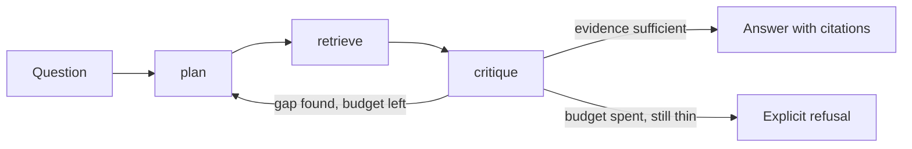

# Architecture — mostly planned, partly implemented

Status: **M1**. The only route is still `GET /health`. The retrieval boundary and
the `retrieve` tool below are code; `plan`, `critique`, the loop that calls them
and the trace are not. The milestones table says which parts are absent.

The question this project exists to answer: **what does a bounded agent loop add
over a single retrieval pass, and how would you tell?** The design below is
arranged so that question stays answerable — every seam is one a fake can stand
in for, so the loop is measurable before it is expensive.

## The loop

The agent is a bounded loop over three tools. The bound is the point: an agent
without a step budget and a stop rule is a way to spend money on tokens until
something times out.



### One pass through the loop

The same shape as text, because the arrows above hide where state accumulates
and where the loop can end:

```
question
   │
   ├─► plan ─────────► sub-questions, ordered, one retrieval each
   │      ▲                       │
   │      │                       ▼
   │      │              retrieve ──► passages + source ids  ──┐
   │      │                       (one sub-question per call)  │
   │      │                                                    ▼
   │      │                                              critique
   │      │                                                    │
   │      │  gap named, steps left                             │
   │      └────────────────────────────────────────────────────┤
   │                                                           │
   │                          evidence sufficient ─────────────┼──► answer + citations
   │                                                           │
   │                          budget spent, still thin ────────┴──► refusal + reason
   ▼
trace: every step, its tool, its evidence, its cost — written whichever way the loop ends
```

Three properties of that shape are deliberate:

- **Only `critique` can end the loop.** `plan` cannot declare success and
  `retrieve` cannot declare failure. One exit point means one place to audit
  when a run ends wrongly.
- **The refusal edge is not an error path.** It is a normal outcome with a
  reason, recorded like any other. A loop that can only answer will invent one.
- **The trace is written on every exit.** A run that refused is the run most
  worth reading later, so the trace is not conditional on success.

## Tool boundary

| Tool | Responsibility | Boundary it must not cross |
| --- | --- | --- |
| `plan` | Turn the question into an ordered list of sub-questions, each answerable by one retrieval call. | It does not retrieve, and it does not answer from parametric memory. |
| `retrieve` | Run one sub-question against the retrieval service and return passages with their source ids. | It does not rank by what would make the answer nicer; ranking belongs to the retrieval service. |
| `critique` | Decide whether the evidence supports an answer, name the gap when it does not, and stop when the budget is spent. | It never fills a gap by inventing a passage. Insufficient evidence ends in a refusal, not a hedge. |

Two rules apply to all three, and they are what make the loop testable rather
than merely describable:

1. **A tool call is a function of its arguments and the retrieval service.** No
   tool reads ambient configuration or global mutable state, so replaying a
   trace's arguments reproduces the step.
2. **Every tool returns evidence or an explicit absence.** A tool never returns
   prose that a later step has to parse to discover whether it worked. The
   difference between "found nothing" and "failed" is a field, not a tone.

### What is not a tool

Stated now, because the cheapest time to refuse a capability is before it has a
call site:

- **No write tool.** The agent reads a corpus; it does not ingest, index, or
  mutate anything in the retrieval service.
- **No shell, no filesystem, no arbitrary HTTP.** The only outbound surface is
  the retrieval boundary below.
- **No sub-agent spawning.** One agent, one loop. Orchestration between agents
  is series project #3 and does not leak backwards into this one.

## The retrieval boundary

Everything the agent knows about the world arrives through one interface with a
single method. Naming it before implementing it is the whole point: it is the
seam where a free deterministic stand-in and a real service are interchangeable.

```python
class RetrievalBackend(Protocol):
    """One sub-question in, ranked evidence out."""

    def search(self, sub_question: str, *, top_k: int) -> Sequence[Passage]: ...
```

This sits *behind* the `retrieve` tool rather than replacing it: the tool is the
loop-facing surface, the backend is the outbound one. Both are protocols so a
test supplies either without a container or a key. As of M1 that shape is code:
`RetrievalBackend` and `RetrieveTool` in `agentic_rag.tools.retrieve`, with the
backend chosen by `build_retrieve_tool()` — the fake unless `PRODUCTION_RAG_URL`
is set.

A `Passage` carries the text, a stable chunk id, and a corpus-relative source
path — the three fields a citation needs to be checkable by someone who does not
trust the agent.

Two implementations are planned, and the loop cannot tell them apart:

| Backend | What it is | When it is used |
| --- | --- | --- |
| `FakeRetrievalBackend` | An in-process fixture over a small committed corpus, deterministic for a given sub-question. | The default. Every test, every CI run, every laptop demo. |
| `HttpRetrievalBackend` | An HTTP client for a running [production-rag](https://github.com/pabloalvarez99/production-rag) instance. | Opt-in, when a real corpus and real retrieval quality matter. |

### Fake first, and what the fake is honest about

The fake is a fixture, not a simulation. It returns passages from a committed
corpus by lexical overlap, which makes multi-step behaviour observable — a
sub-question that narrows the topic retrieves different passages than the
original question did — without pretending to be a retrieval quality result.

What it therefore cannot support: any claim about retrieval quality, ranking
quality, or answer quality. A loop that works against the fake has proved its
control flow, its budget accounting, its trace, and its refusal path. It has
proved nothing about whether the agent finds better evidence than one pass.
Deciding that needs the HTTP backend against a real corpus, and the reasoning is
recorded in [ADR-0001](adr/0001-fake-first.md).

### HTTP to production-rag

The opt-in backend speaks to production-rag's versioned query route. The request
and response shapes below are the ones that service already publishes, so this
is an integration, not a new contract:

```
POST {PRODUCTION_RAG_URL}/v1/query
X-Request-ID: <the agent's run id, so both services' logs join>

{"question": "<sub-question>", "mode": "hybrid", "llm": "fake", "embedder": "fake"}
```

```
200 OK
{"answer": "...", "citations": [{"marker": 1, "chunk_id": "...", "source_path": "...",
                                 "text": "...", "rank": 1}],
 "refused": false, "refusal_reason": null}
```

Four consequences of using that route rather than reimplementing retrieval:

- **The agent reads `citations`, not `answer`.** Each citation is already a
  passage with a chunk id and a source path, which is exactly `Passage`. The
  generated `answer` from the inner service is a single-pass answer; treating it
  as evidence would make the agent a paraphraser of another model's output.
- **`refused: true` is information, not a failure.** It means one sub-question
  found no support in the corpus. That is a gap `critique` can name, and a run
  where every sub-question refuses is a correct refusal, not a broken run.
- **`embedder` must match how the corpus was ingested.** A query embedded by a
  different model than the index searches the wrong space, and the ranking is
  meaningless rather than merely worse. The default pairing is the deterministic
  one on both sides.
- **`llm: "fake"` keeps the inner service free.** The agent's own generation is
  a separate decision from the retrieval service's, and both default to free.

### The library path, and why it is not the default

production-rag is also importable: `run_query()` in
`production_rag.query_pipeline` takes a retriever and an LLM and returns a
`QueryResult` whose `refusal_reason` comes from a closed set, so a caller can
branch on it. That is a genuinely better-typed boundary than HTTP.

It is still not the default, for one concrete reason: the library's retriever is
constructed from a vector store and an embedding provider, so importing it pulls
the vector store client, the embedding stack, and their version constraints into
this process. The HTTP boundary keeps that entire dependency tree on the other
side of a port. The library path stays documented and available for a future
in-process evaluation harness, where the extra coupling buys speed on thousands
of calls; the loop itself does not need it.

Either way, the rule is the one that P2's entry criteria state: **P1 is
consumed, not copied.** No retrieval, fusion, rerank or citation-resolution code
is reimplemented here. A fork of the retrieval stack would make the comparison
in the next section meaningless — the agent would no longer be measured against
the same floor.

## What it inherits from production-rag

The retrieval substrate is
[production-rag](https://github.com/pabloalvarez99/production-rag): hybrid dense
plus sparse retrieval fused with reciprocal rank fusion, a cross-encoder rerank
pass, grounded answers whose citation markers resolve to real chunks, and a
refusal that is a first-class outcome rather than an error. This project treats
that service as a dependency and reuses three of its rules verbatim:

- **Evidence or refusal.** A step that cannot cite does not answer.
- **Free by default.** Deterministic local providers are the default path, so
  the whole loop runs in CI and on a laptop with no credential.
- **A number carries its provenance.** Any published measurement states its
  providers, its sample size, its date and its commit, or it is not published.

### How the comparison will work

The agent is measured against the single pass it wraps, on the same questions,
in the same order — the single pass being production-rag answering the original
question directly, with no planning and no second retrieval. Two rules borrowed
from P1's reporting boundary:

- The question set has to be one the single pass **provably** cannot answer,
  established by a mechanical predicate rather than intuition. A set the
  baseline already solves makes the agent look useful by construction.
- A delta becomes a claim only when its sample size and interval allow it. An
  agent that spends five steps and wins nothing has to be publishable as exactly
  that.

## Provider stance

The default providers are deterministic fakes, chosen so a run is repeatable and
free. A hosted provider is an opt-in override, never a default, and no code path
reads a key to serve the scaffold. `.env.example` lists the variable names a
future paid path would use; it carries no values. The reasoning, its rejected
alternatives, and the conditions under which the paid path opens are in
[ADR-0001](adr/0001-fake-first.md).

## Milestones

| Milestone | Contents | State |
| --- | --- | --- |
| M0 | Package, liveness probe, test harness, this document | **LIVE** |
| M1 | `retrieve` tool over the `RetrievalBackend` seam, with the fake backend, and `ResearchState` carrying the step budget | **LIVE** |
| M2 | `plan` tool and the step budget | planned |
| M3 | `critique` tool, the stop rule, and the refusal path | planned |
| M4 | Trace of the loop: every step, its tool, its evidence, its cost | planned |
| M5 | HTTP backend against a running production-rag instance | client written at M1, never yet run against a real instance |
| M6 | Offline evaluation of the loop against a fixed question set, paired against the single pass | planned |

M1 through M4 need no credential and no running retrieval service. That is the
ordering the ADR argues for: the loop is complete and measurable on the free
path before anything is billed.

## Open questions

- ~~Where does the step budget live — per question, per run, or both?~~ Answered
  at M1, provisionally: per run, in `ResearchState`, enforced by the state rather
  than by whoever writes the loop — a budget checked at the call site has as many
  rules as it has call sites. Whether a per-sub-question budget is also needed
  stays open until `plan` exists.
- Does `critique` see the retrieved passages, or only the claims made from them?
  Seeing both is more capable and makes the critique harder to trust.
- What does the trace have to record for a failed run to be diagnosable a week
  later without rerunning it?
- Is a repeated sub-question a bug or a signal? `plan` reissuing a sub-question
  after `critique` names a gap may be a legitimate retry with a narrower framing,
  or a loop that has stopped making progress. The stop rule needs an answer that
  does not require reading the prose.
- What is the mechanical predicate for "the single pass provably cannot answer
  this"? Multi-document evidence is one candidate; a fact that only surfaces
  after a first retrieval narrows the question is another. Neither is settled.
